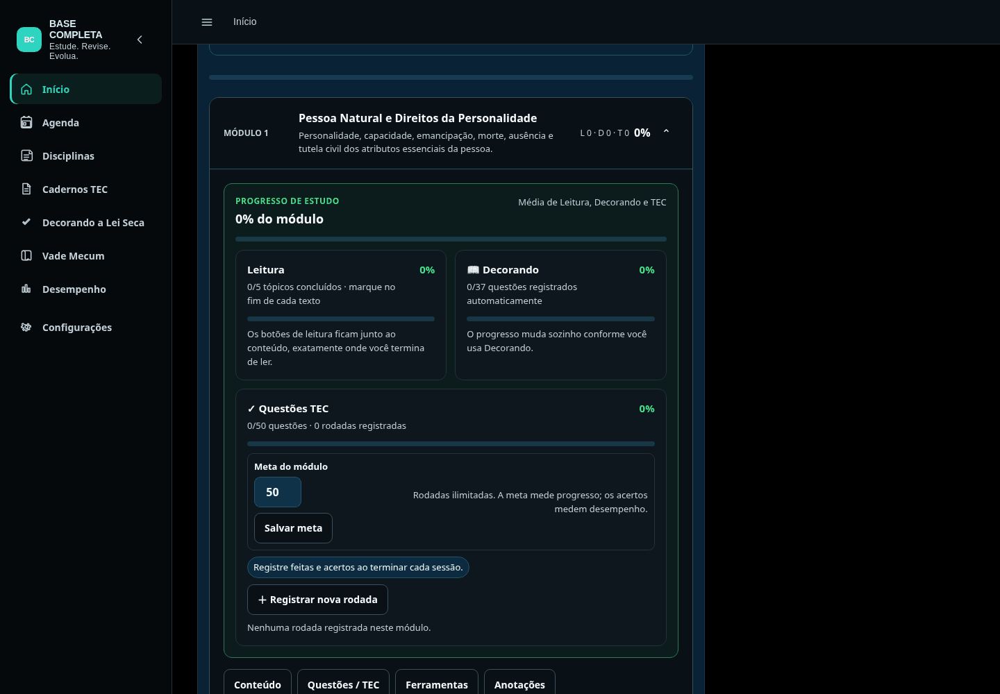
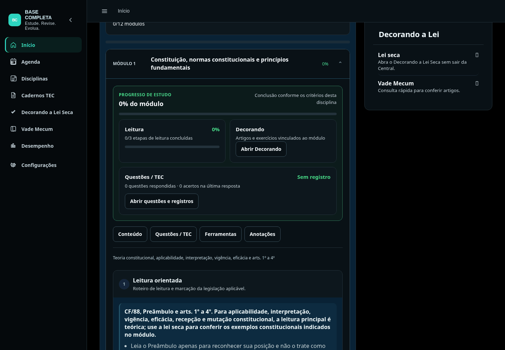

# Visual das disciplinas baseado em Direito Civil

A apresentação dos 162 módulos das dez disciplinas passa a compartilhar cabeçalhos, cartões de progresso, navegação, leitura, botões, anotações e comportamento em telas pequenas. Direito Civil mantém seu painel nativo de Leitura, Decorando e TEC como referência.

Nas outras disciplinas, o painel consulta os dados existentes. Os critérios de conclusão continuam próprios de cada curso: a alteração não equipara cálculos, não cria resultados de acertos e não altera o conteúdo pedagógico. Português mostra a quantidade de respostas; Constitucional, Penal e Processo Civil mostram o resultado da última resposta às questões do módulo.

A navegação comum leva ao conteúdo, às questões, às ferramentas já disponíveis e às anotações. Onde não havia campo de anotação, ele foi adicionado com salvamento local e uma chave exclusiva por disciplina e módulo. As anotações nativas conservam seus controles e armazenamento. Os novos campos também leem as anotações da padronização anterior publicada, sem apagar as chaves existentes.

## Arquivos

- `ui/discipline-standard.js` e `ui/discipline-standard.css`: apresentação compartilhada, sem substituir a renderização e os controles nativos.
- `central-v119.html` e `sw.js`: carregamento e versão do cache dos novos arquivos. A apresentação anterior de `central-module-standard-v1.js` foi substituída pelo adaptador compartilhado; seu arquivo permanece no histórico e no repositório.
- `central-reading-font-v66126.js`: base de leitura de 16px, mantendo a preferência de escala.
- `cpc-flow-visual-v1.js`: evita alterações repetidas de texto pelo observador visual de Processo Civil.

## Verificação

- Sintaxe dos arquivos JavaScript e `git diff --check`.
- Contagem dos 162 módulos e abertura do primeiro módulo de cada uma das dez disciplinas: painel, navegação e um campo de anotação.
- Ausência de transbordamento horizontal nos primeiros módulos das dez disciplinas em 320px e 390px; conferência em 1440px para Direito Civil.
- Anotação de Direito Civil preservada após renderização nativa e recarregamento.
- Conclusão de leitura de Direito Civil e de Processo Penal, além de uma rodada TEC de Processo Penal, preservadas após recarregamento.
- Respostas salvas de Constitucional, Penal e Processo Civil refletidas no painel comum, incluindo percentual de acertos.
- Nenhum erro JavaScript de execução observado nesses fluxos.

A verificação de apresentação usa o conteúdo já renderizado e os controles dos módulos. Não é uma auditoria completa de todas as aulas carregadas sob demanda, de sincronização externa ou de funcionamento offline do aplicativo.

## Comparação visual

| Referência | Outra disciplina |
| --- | --- |
|  |  |
|  |  |

## Publicação

A implementação inicial partiu da `main` no commit `872ca43e4fdfbdc662c0952e12bcfbad0f8520fd`. Para a publicação autorizada, foram incorporados os ajustes da versão de produção no commit `ea2489fd6d4266ea9e69e26c1696794e22cbba24`, da branch `work/padronizacao-modulos-20260930`. Isso conserva os ajustes de sincronização, atalhos, etapas, rodapés e notas já presentes no site. O novo adaptador assume apenas a padronização visual dos módulos.
